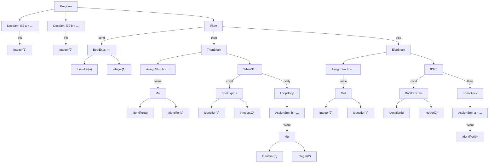

# Mini 语言 LL(1) 文法与推导示例

## 1. 终结符约定

以下终结符与当前 `Lexer` 保持一致：

| 记号    | 含义       |
| ------- | ---------- |
| `i32`   | 类型关键字 |
| `if`    | 条件分支   |
| `else`  | 否则分支   |
| `while` | 循环       |
| `id`    | 标识符     |
| `num`   | 非负整数   |
| `=`     | 赋值       |
| `==`    | 相等比较   |
| `<`     | 小于比较   |
| `+`     | 加法       |
| `*`     | 乘法       |
| `(` `)` | 圆括号     |
| `{` `}` | 语句块     |
| `;`     | 语句结束   |
| `$`     | 输入结束符 |

说明：

- 空白符和 `#` 单行注释会在词法分析阶段被消去，不进入语法分析。
- `BoolExpr` 目前只支持关系表达式 `ArithExpr RelOp ArithExpr`。
- `Block` 强制使用花括号，因此不存在悬空 `else` 问题。

## 2. 产生式表

开始符号：`Program`

| 编号 | 产生式                                    |
| ---- | ----------------------------------------- |
| (1)  | `Program -> StmList`                      |
| (2)  | `StmList -> Stm StmList`                  |
| (3)  | `StmList -> ε`                            |
| (4)  | `Stm -> DeclStm`                          |
| (5)  | `Stm -> AssignStm`                        |
| (6)  | `Stm -> IfStm`                            |
| (7)  | `Stm -> WhileStm`                         |
| (8)  | `DeclStm -> i32 id = ArithExpr ;`         |
| (9)  | `AssignStm -> id = ArithExpr ;`           |
| (10) | `IfStm -> if ( BoolExpr ) Block ElsePart` |
| (11) | `ElsePart -> else Block`                  |
| (12) | `ElsePart -> ε`                           |
| (13) | `WhileStm -> while ( BoolExpr ) Block`    |
| (14) | `Block -> { StmList }`                    |
| (15) | `BoolExpr -> ArithExpr RelOp ArithExpr`   |
| (16) | `RelOp -> ==`                             |
| (17) | `RelOp -> <`                              |
| (18) | `ArithExpr -> Term ArithTail`             |
| (19) | `ArithTail -> + Term ArithTail`           |
| (20) | `ArithTail -> ε`                          |
| (21) | `Term -> Factor TermTail`                 |
| (22) | `TermTail -> * Factor TermTail`           |
| (23) | `TermTail -> ε`                           |
| (24) | `Factor -> id`                            |
| (25) | `Factor -> num`                           |
| (26) | `Factor -> ( ArithExpr )`                 |

## 3. FIRST / FOLLOW 表

| 非终结符    | FIRST                       | FOLLOW                                 |
| ----------- | --------------------------- | -------------------------------------- |
| `Program`   | `{ i32, id, if, while, ε }` | `{ $ }`                                |
| `StmList`   | `{ i32, id, if, while, ε }` | `{ '}', $ }`                           |
| `Stm`       | `{ i32, id, if, while }`    | `{ i32, id, if, while, '}', $ }`       |
| `DeclStm`   | `{ i32 }`                   | `{ i32, id, if, while, '}', $ }`       |
| `AssignStm` | `{ id }`                    | `{ i32, id, if, while, '}', $ }`       |
| `IfStm`     | `{ if }`                    | `{ i32, id, if, while, '}', $ }`       |
| `ElsePart`  | `{ else, ε }`               | `{ i32, id, if, while, '}', $ }`       |
| `WhileStm`  | `{ while }`                 | `{ i32, id, if, while, '}', $ }`       |
| `Block`     | `{ '{' }`                   | `{ else, i32, id, if, while, '}', $ }` |
| `BoolExpr`  | `{ id, num, '(' }`          | `{ ')' }`                              |
| `RelOp`     | `{ ==, < }`                 | `{ id, num, '(' }`                     |
| `ArithExpr` | `{ id, num, '(' }`          | `{ ';', '==', '<', ')' }`              |
| `ArithTail` | `{ +, ε }`                  | `{ ';', '==', '<', ')' }`              |
| `Term`      | `{ id, num, '(' }`          | `{ '+', ';', '==', '<', ')' }`         |
| `TermTail`  | `{ *, ε }`                  | `{ '+', ';', '==', '<', ')' }`         |
| `Factor`    | `{ id, num, '(' }`          | `{ '*', '+', ';', '==', '<', ')' }`    |

## 4. LL(1) 预测分析表

下表只列出非空项；未列出的单元都视为 `error`。

| 非终结符    | 向前看符号                                | 选用产生式                                     |
| ----------- | ----------------------------------------- | ---------------------------------------------- |
| `Program`   | `i32` / `id` / `if` / `while` / `$`       | `(1) Program -> StmList`                       |
| `StmList`   | `i32` / `id` / `if` / `while`             | `(2) StmList -> Stm StmList`                   |
| `StmList`   | `}` / `$`                                 | `(3) StmList -> ε`                             |
| `Stm`       | `i32`                                     | `(4) Stm -> DeclStm`                           |
| `Stm`       | `id`                                      | `(5) Stm -> AssignStm`                         |
| `Stm`       | `if`                                      | `(6) Stm -> IfStm`                             |
| `Stm`       | `while`                                   | `(7) Stm -> WhileStm`                          |
| `DeclStm`   | `i32`                                     | `(8) DeclStm -> i32 id = ArithExpr ;`          |
| `AssignStm` | `id`                                      | `(9) AssignStm -> id = ArithExpr ;`            |
| `IfStm`     | `if`                                      | `(10) IfStm -> if ( BoolExpr ) Block ElsePart` |
| `ElsePart`  | `else`                                    | `(11) ElsePart -> else Block`                  |
| `ElsePart`  | `i32` / `id` / `if` / `while` / `}` / `$` | `(12) ElsePart -> ε`                           |
| `WhileStm`  | `while`                                   | `(13) WhileStm -> while ( BoolExpr ) Block`    |
| `Block`     | `{`                                       | `(14) Block -> { StmList }`                    |
| `BoolExpr`  | `id` / `num` / `(`                        | `(15) BoolExpr -> ArithExpr RelOp ArithExpr`   |
| `RelOp`     | `==`                                      | `(16) RelOp -> ==`                             |
| `RelOp`     | `<`                                       | `(17) RelOp -> <`                              |
| `ArithExpr` | `id` / `num` / `(`                        | `(18) ArithExpr -> Term ArithTail`             |
| `ArithTail` | `+`                                       | `(19) ArithTail -> + Term ArithTail`           |
| `ArithTail` | `==` / `<` / `)` / `;`                    | `(20) ArithTail -> ε`                          |
| `Term`      | `id` / `num` / `(`                        | `(21) Term -> Factor TermTail`                 |
| `TermTail`  | `*`                                       | `(22) TermTail -> * Factor TermTail`           |
| `TermTail`  | `+` / `==` / `<` / `)` / `;`              | `(23) TermTail -> ε`                           |
| `Factor`    | `id`                                      | `(24) Factor -> id`                            |
| `Factor`    | `num`                                     | `(25) Factor -> num`                           |
| `Factor`    | `(`                                       | `(26) Factor -> ( ArithExpr )`                 |

由上表可见，每个 `(非终结符, 向前看)` 组合至多对应一条产生式，因此该文法满足 LL(1) 要求，可直接写成递归下降分析器。

## 5. 简单句子的最左推导示例

以下示例都省略词法分析阶段；也就是说，`id` 和 `num` 已经是 `Lexer` 产出的终结符。

### 5.1 `i32 a = 1;`

| 步骤 | 最左推导                               |
| ---- | -------------------------------------- |
| 1    | `Stm`                                  |
| 2    | `DeclStm`                              |
| 3    | `i32 id = ArithExpr ;`                 |
| 4    | `i32 id = Term ArithTail ;`            |
| 5    | `i32 id = Factor TermTail ArithTail ;` |
| 6    | `i32 id = num TermTail ArithTail ;`    |
| 7    | `i32 id = num ArithTail ;`             |
| 8    | `i32 id = num ;`                       |
| 9    | `i32 a = 1 ;`                          |

### 5.2 `a = b * 2;`

| 步骤 | 最左推导                                |
| ---- | --------------------------------------- |
| 1    | `Stm`                                   |
| 2    | `AssignStm`                             |
| 3    | `id = ArithExpr ;`                      |
| 4    | `id = Term ArithTail ;`                 |
| 5    | `id = Factor TermTail ArithTail ;`      |
| 6    | `id = id TermTail ArithTail ;`          |
| 7    | `id = id * Factor TermTail ArithTail ;` |
| 8    | `id = id * num TermTail ArithTail ;`    |
| 9    | `id = id * num ArithTail ;`             |
| 10   | `id = id * num ;`                       |
| 11   | `a = b * 2 ;`                           |

### 5.3 `while (b < 10) { b = b * 2; }`

| 步骤 | 最左推导                                                             |
| ---- | -------------------------------------------------------------------- |
| 1    | `Stm`                                                                |
| 2    | `WhileStm`                                                           |
| 3    | `while ( BoolExpr ) Block`                                           |
| 4    | `while ( ArithExpr RelOp ArithExpr ) Block`                          |
| 5    | `while ( Term ArithTail RelOp ArithExpr ) Block`                     |
| 6    | `while ( Factor TermTail ArithTail RelOp ArithExpr ) Block`          |
| 7    | `while ( id RelOp ArithExpr ) Block`                                 |
| 8    | `while ( id < ArithExpr ) Block`                                     |
| 9    | `while ( id < Term ArithTail ) Block`                                |
| 10   | `while ( id < Factor TermTail ArithTail ) Block`                     |
| 11   | `while ( id < num ) Block`                                           |
| 12   | `while ( b < 10 ) { StmList }`                                       |
| 13   | `while ( b < 10 ) { Stm StmList }`                                   |
| 14   | `while ( b < 10 ) { AssignStm StmList }`                             |
| 15   | `while ( b < 10 ) { id = ArithExpr ; StmList }`                      |
| 16   | `while ( b < 10 ) { id = Term ArithTail ; StmList }`                 |
| 17   | `while ( b < 10 ) { id = Factor TermTail ArithTail ; StmList }`      |
| 18   | `while ( b < 10 ) { id = id * Factor TermTail ArithTail ; StmList }` |
| 19   | `while ( b < 10 ) { id = id * num ; StmList }`                       |
| 20   | `while ( b < 10 ) { b = b * 2 ; }`                                   |

## 6. `input-1` 的压缩语法树

`tests/example/input-1.txt` 中的两条注释会在词法阶段被移除，因此真正进入语法分析的串是：

```text
i32 a = 1;
i32 b = 0;
if (a == 1) {
    b = a * a;
    while (b < 10) {
        b = b * 2;
    }
} else {
    b = 2 * a;
    if (b == 2) {
        a = b;
    }
}
```

完整分析树若把 `StmList`、`ArithTail`、`TermTail`、`ElsePart` 和所有 `ε` 节点全部展开，会非常长。下面给出与该文法一一对应的压缩语法树：保留主要语法成分，省略括号、分号和空产生式节点。



这棵树对应的语义结构可以直接整理成 AST：

- 顶层有 3 条语句：2 个声明，1 个 `if-else`
- `if` 的 `then` 分支里有 1 条赋值和 1 个 `while`
- `while` 的循环体里有 1 条赋值
- `else` 分支里有 1 条赋值和 1 个嵌套 `if`
- 最内层 `if` 的 `then` 分支里有 1 条赋值
