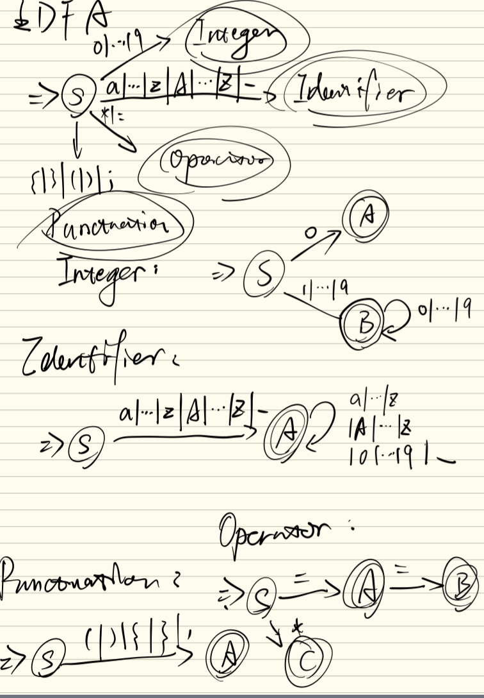

# 实验报告

## 词汇表

Token 所有类型如下：

| 序号 | 类型     | 说明                     |
| ---- | -------- | ------------------------ |
| 1    | identifier   | 记号，以 `_` 或字母开头的单词 |
| 2    | keyword   | 保留记号，以 `_` 或字母开头的单词，`if`, `else`, `i32` |
| 3    | non-negative integer   | 非负的整数（不含负数和浮点数） |
| 4    | punctuation   | `(`, `)`, `{`, `}`, `;` |
| 5    | operator   | `=`, `==` |

特殊符号：

- `#`：单行注释符

## 词法规则

考虑到 RG 并不分自然地区分 identifier 和 keyword，所以将其整合进入一个 DFA 处理，最后再使用工程方法区分。

### DFA 图片参考



工程化落地 DFA 时的核心是：

对于非终态，peek 到非预期字符，则报错。
对于终态，peek 到非预期字符，则不报错退出；peek 到预期字符，则继续 step；若无须 peek，则直接退出。

### Ident & Keyword

Regex：[a-zA-Z\_][a-zA-Z0-9\_]*

### Integer

Regex：0|[1-9][0-9]*

### Operator

Regex：==|=

### Punctuation

Regex：[\(\)\{\};]

## 设计过程

### Lexer

词法核心的是 token，而出于性能和优雅性的考虑，在工程上设计 Lexer 为一个流是很自然的想法。

因此先将 Lexer 的核心核心接口写出来：

```rust
pub fn next_token(&mut self) -> LexerResult {
    // ...
}
```

Lexer 相当于一个主 DFA，它负责 peek input 流中的一个特定的字符，来决定该如何 dispatch 流到特定的子 DFA。

### 子 DFA

每个 DFA 核心接口为：

```rust
pub trait Automaton {
    // try_accept 尝试接受输入，如果成功则返回 Ok(Token)，否则返回 Err(Error)
    fn try_accept(
        &mut self,
        buf: &mut [char],
        maxlen: usize,
        input: &mut impl Input,
    ) -> LexerResult;

    // acceptable 判断一个字符是否可以被当前自动机接受，如果可以接受则返回 true，否则返回 false
    fn acceptable(&self, c: char) -> bool;
}
```

#### Integer DFA

数字的 regex 为 0|[1-9][0-9]*
对应 DFA：
S：初始状态，接受输入 0，转移到 A；接受输入 1-9，转移到 B；接受其他输入，停机
A：终态，直接停机
B：接受输入 0-9，停机；接受其他输入，停机

#### Ident & Keyword DFA

标识符 & 关键字的 regex 为 [a-zA-Z\_][a-zA-Z0-9\_]*
对应 DFA：
S：初始状态，接受输入 a-zA-Z_，转移到 A；接受其他输入，停机
A：接受输入 a-zA-Z0-9_，停机；接受其他输入，停机

最后额外添加一个使用 HashSet，将 keyword 拦截的功能。

#### Operator DFA

运算符的 regex 为 ==|=|*
对应 DFA：
S：初始状态，接受输入 '='，转移到 A；接受输入 '*'，转移到 C；接受其他输入，停机
A：接受输入 '='，转移到 B；接受其他输入，停机，这也是一个终态
B：终态，直接停机
C：终态，直接停机

#### Punctuation DFA

分隔符的 regex 为 [\(\)\{\};]
对应 DFA：
S：初始状态，接受输入 ( ) { } ;，然后转移到状态 A；接受其他输入，停机
A：终态，直接停机

## 测试用例设计思路

核心是自底向上，先测子 DFA，再测总 DFA（Lexer）。

### 子 DFA 单元测试

每类 automaton 独立测试，覆盖三条轴：

| 维度 | 测试内容 | 例 |
|------|---------|------|
| 正常路径 | 合法输入 → 正确 Token | `"123" → Integer(123)`, `"if" → Keyword("if")` |
| 边界情况 | 空输入、零、单字符、特殊字符 | `"" → EndOfInput`, `"0" → Integer(0)`, `"*" → Operator("*")` |
| 错误路径 | 非法起始/后续字符 | `"1var" → InvalidChar('1')`, `"@" → UnexpectedChar('@')` |

关键设计点：

- Integer：单独测试 `0` 接受后指针停在前导数字前（`"0123" → Integer(0), peek=Some('1')`），验证前导零拒绝策略
- Operator：`=` 的贪心匹配（`"===" → Operator("=="), peek=Some('=')`），`*` 的非贪心单字符行为（`"**" → Operator("*"), peek=Some('*')`）
- Identifier：关键字与标识符的运行时区分，`_tmp` 前缀、遇 `(` 停止（`"if(flag)" → Keyword("if"), peek=Some('(')`）
- Punctuation：五种分隔符逐一覆盖，遇第二个同类字符停止

### Lexer 集成测试

按如下顺序测试：

1. 空白与注释：空格/换行 `left_trim`、`#` 行注释跳过、连续注释、空白+注释+EOF 组合
2. 调度优先级：`"123abc"` 验证数字优先于标识符被 dispatch，产出一个 Integer + 一个 Identifier
3. 单 token → 多 token 序列：`"a=1"`、`"a * b"`、`"=="` 与 `";"` 的 operator/punctuation 区分
4. 声明语句：`"i32 a = 1;"` 覆盖 keyword → identifier → operator → integer → punctuation → EOF 完整链路
5. 关键字拦截：`if`、`else` 返回 `Token::Keyword` 而非 `Identifier`
6. 复杂代码块：`"if (a == 1) { b = 1; } else { b = 2; }"` 模拟真实语法片段
7. 注释与代码混合：`"i32 a = 1; # inline comment\ni32 b = 2;"` 验证注释跳过前后状态正确
